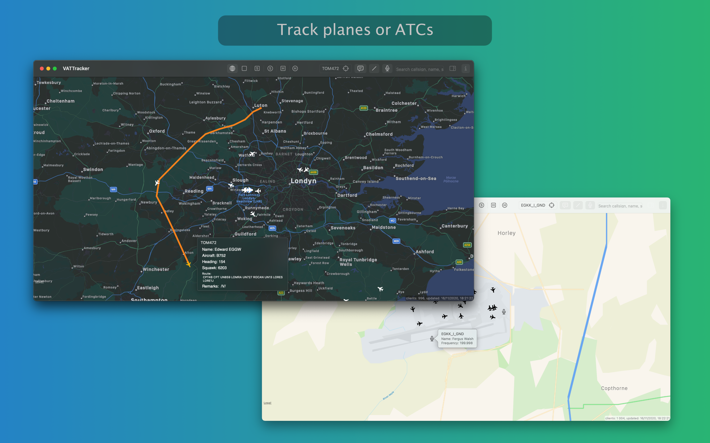
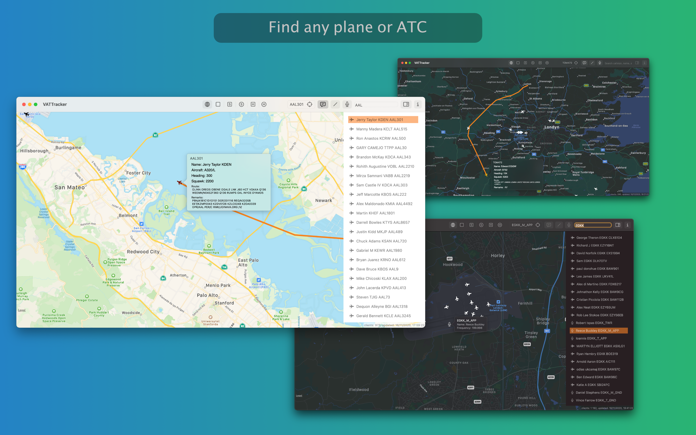
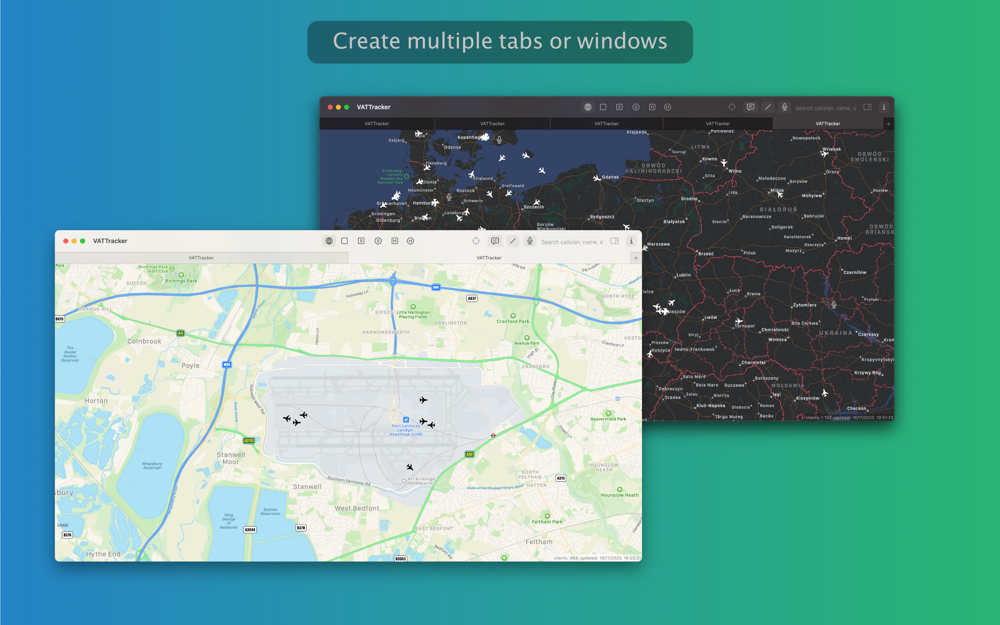

## Welcome to VATTracker project

VATTracker is a plane and ATC tracker allowing you to find any ATC or a plane currently connected to VATSIM network - track its course and display additional details.

You can use VATTracker to find any ATC or find and track any plane currently available in VATSIM network and display details provided by a pilot.

VATTracker is using public data provided by VATSIM network, no VATSIM account is required.

### Features

- find a plane or ATC by callsign, flight name or squawk
- track selected plane (map will re-center itself on a target when it will be out of boundaries)
- track multiple planes in tabs or windows
- switch between multiple map types: standard, muted, satellite, satellite flyover, hybrid, hybrid flyover
- show trails for selected plane (this is plotted using data provided by VATSIM, not the actual flight plan)
- display information provided by ATC (like frequency) or a pilot (pilot name, flight name, squawk, heading, aircraft type, route details, etc.)
- position of all VATSIM entities is refreshed periodically as provided by VATSIM (usually it's once every 60s)
- switch between light and dark mode (as set by macOS)

### Support

In case you'll need assistance, spot a bug or require a help, please create [a new issue](https://github.com/elewarr/VATTracker-App-Store/issues/new).

You may also review [existing issues](https://github.com/elewarr/VATTracker-App-Store/issues).

### Screenshots

